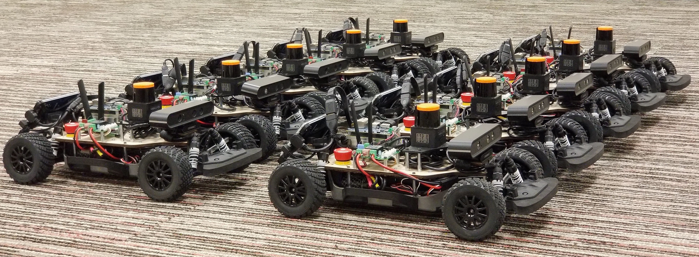

### UT-AUTOmata

AMRL is home to the UT-AUTOmata, a fleet of scale 1/10th autonomous vehicles
used for robotics education and research.

{: .center-image width="800px" }

### Media

#### UT-AUTOmata Overview Video

<iframe width="560" height="315" src="https://www.youtube.com/embed/0s0URZ9IyTs" frameborder="0" allow="autoplay; encrypted-media" allowfullscreen=""></iframe>

#### High-Speed Autonomous Offroad Driving

<iframe width="560" height="315" src="https://www.youtube.com/embed/QJDINgrtlCc" frameborder="0" allow="autoplay; encrypted-media" allowfullscreen=""></iframe>

#### Multi-Agent Coordination

<iframe width="560" height="315" src="https://www.youtube.com/embed/fib4kDVA8O0" frameborder="0" allow="autoplay; encrypted-media" allowfullscreen=""></iframe>

#### UT-AUTOmata Robot Exhibition

<iframe width="569" height="315" src="https://www.youtube.com/embed/ClYvJHcrxlg" title="YouTube video player" frameborder="0" allow="accelerometer; autoplay; clipboard-write; encrypted-media; gyroscope; picture-in-picture" allowfullscreen></iframe>

---

#### Course Offerings

[Spring 2023: CS378/ME379M/ME397/ECE394J/ECE379K Connected Autonomous Electric Vehicles](https://www.joydeepb.com/assets/cs378sp23_caev.pdf)
[Spring 2022: CS 378H Autonomous Driving - Honors](https://amrl.cs.utexas.edu/CS378H-S22/)  
[Fall 2021: CS393R Autonomous Robots](https://amrl.cs.utexas.edu/CS393R-F21/)  
[Spring 2021: CS378 F1/10 Autonomous Driving](https://amrl.cs.utexas.edu/CS378-F1Tenth-Autonomous-Driving-S21/)  
[Fall 2020: CS393R Autonomous Robots](https://amrl.cs.utexas.edu/CS393R-F20/)  
[Spring 2020: CS378 F1/10 Autonomous Driving](https://amrl.cs.utexas.edu/CS378-F1Tenth-Autonomous-Driving-S20/) 

### Publications
List of related publications. 
<table class="display" id="pubTable"></table>  
 

### Software
[Simulation and Hardware Driver Code/Instruction](https://github.com/ut-amrl/ut_automata)

[Reference Manual](https://docs.google.com/document/d/1bCMpkDbM7aS7DyQgcPHe31QnpRPS7O6782Pj3Ezpnqo)

### Hardware
[UT AUTOmata List of Components By Vendor](https://docs.google.com/spreadsheets/d/197W5ejMjJ3xfXrE_wAcsbsO1OQzT3U3aU18hYu6106I/edit#gid=0)

[Hardware Setup Guide](https://docs.google.com/document/d/1TKbYQWP1WYjAUvRWu4ax6k6G6X0Uz_t_NtNbm66m3Zg/edit?usp=sharing)

[Laser Cut Mount Drawing](https://drive.google.com/file/d/1RPymBisQeDRHvxa1WU5EiqHT4_zi8XWi/view)

[Powerboard Schematics](https://drive.google.com/file/d/1vMpDWKRZlicEmgoSk4oGKN8NKZrA9UsG/view)

<link href="./assets/bib-publication-list.css" rel="stylesheet" type="text/css" />

<pre id="bibtex" style="display:none;">./ut_automata-references.bib</pre>

