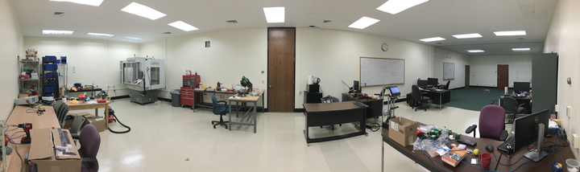
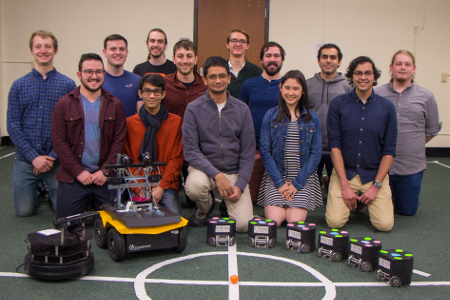
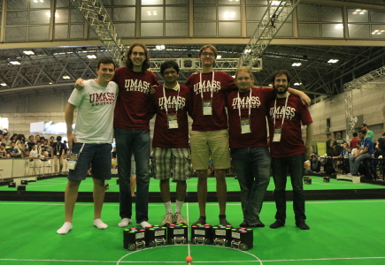
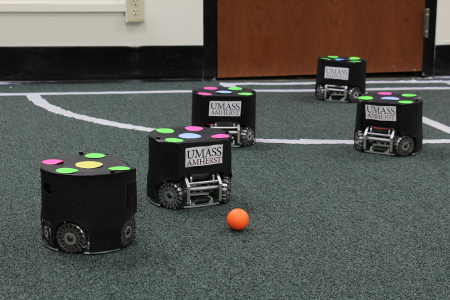
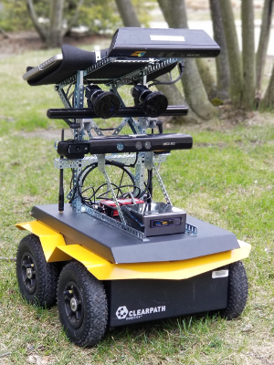

<link rel="stylesheet" type="text/css" href="//cdn.jsdelivr.net/npm/slick-carousel@1.8.1/slick/slick.css"/>
<link rel="stylesheet" type="text/css" href="//cdn.jsdelivr.net/npm/slick-carousel@1.8.1/slick/slick-theme.css"/>

  

  

  

  

  

  

The Autonomous Mobile Robotics Laboratory (AMRL), led by professor Joydeep
Biswas, performs research in robotics to continually make robots more
autonomous, accurate, robust, and efficient, in real-world unstructured
environments. We are working on a wide range of problems, including perception
for long-term autonomy, high-speed multi-agent planning in adversarial domains,
time-optimal control for omnidirectional robots, and correcting and learning
complex autonomous behaviors from human interactions.

The AMRL is comprised of students, robots, and facilities across two
universities - the Computer Science department
at UT Austin, and the College of Information and Computer Sciences, University
of Massachusetts Amherst.

