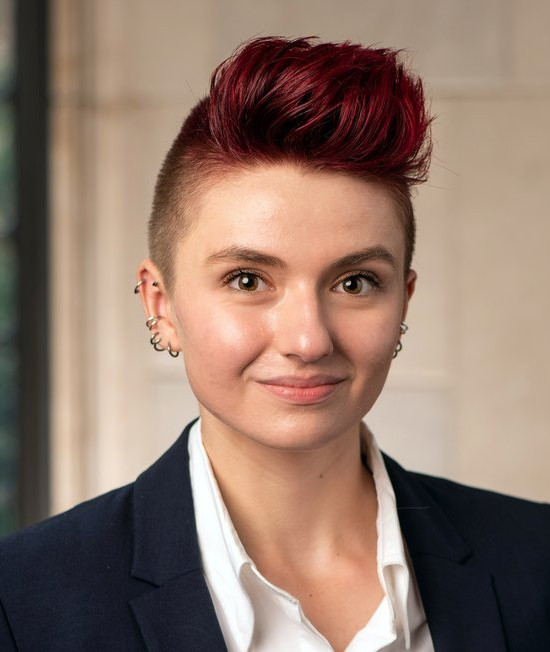
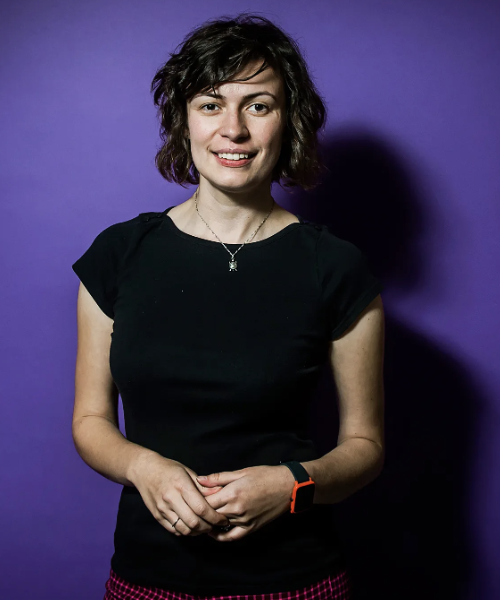

 October 1-5, 2023 at IROS'23, Detroit MI USA

Overview
--------
***

There is significant interest in deploying autonomous robots in unstructured human environments over extended periods of time, with applications ranging from domestic robots to service robots in the workplace, hospitals, and commercial establishments, last-mile delivery robots, and autonomous vehicles. With such unstructured environments come unexpected challenges, unexpected effects of actions, and new ways to arrive at erroneous perceptual results or planning outcomes. Competence-aware autonomy is a promising approach to address such challenges: to anticipate uncertainty and errors, to discover new failure modes, and to learn to (semi-) autonomously overcome such failures.  Competence-aware autonomy has the ability to know, reason about, and act on the extent of its own capabilities in any situation in the context of different sources of external assistance. This workshop will draw together researchers from both academia and industry interested in sharing promising ideas for competence-aware autonomy, highlighting challenging unsolved problems in the area, and learning more about the real-world impact of this work.

Invited Speakers
----------------
***

| [Tesca Fitzgerald](https://www.tescafitzgerald.com/) | [Anca Dragan](https://people.eecs.berkeley.edu/~anca/) | [Jie Tan](https://www.jie-tan.net/) |
| Yale University    | UC Berkeley    | Google |
|  |  |   |

| [Thomas Dietterich](https://web.engr.oregonstate.edu/~tgd/) | [Nick Hawes](https://www.robots.ox.ac.uk/~nickh/) |
| Oregon State University        |  University of Oxford    |
|  |  |

Call for Papers
---------------

***

We invite participants to submit either short (4+n) or long papers (8+n). We encourage the submission of early ideas, late-breaking results, position papers, or open research questions that are likely to generate interesting discussions. Accepted papers will be presented in a poster session and selected papers as spotlight talks. All submitted contributions will go through a single blind review process.

Topics of Interest
---------------
***

The topics of interest for the workshop include (but are not limited to):

* Representation and metrics of competence of perception and planning
* Self-estimation of competence in perception and planning
* Learning competence models from human feedback
* Metareasoning for competence-aware autonomy
* Fault/anomaly detection
* Overcoming failures in the real world
* Methods for maintaining safe states
* Uncertainty-aware planning
* Risk-reward metareasoning
* Computation offloading
* Adaptive and introspective reasoning processes
* Verifiable autonomy

Submission
---------------
***

To be announced

Important Dates
---------------
***

*   **Submission deadline:** Tentatively early August 2023
*   **Notification of acceptance:** Tentatively early September 2023
*   **Camera Ready Submission:** At least 2 weeks before workshop date, tentatively mid-September 2023
*   **Workshop day:** October 1 or 5, 2023.

Program (subject to change)
---------------
***

| Time            | Event                             | Talk Title |
| --------------- | --------------------------------- ||
| 09:00 - 09:05   | Introductory Remarks              ||
| 09:05 - 09:50   | Invited Talk 1                    ||
| 09:50 - 10:30   | Spotlight Talks                   ||
| 10:30 - 10:45   | Break                             ||
| 10:45 - 11:30   | Invited Talk 2                    ||
| 11:30 - 13:00   | Lunch                             ||
| 13:00 - 13:45   | Invited Talk 3                    ||
| 13:45 - 14:30   | Poster Session                    ||
| 14:30 - 15:15   | Invited Talk 4                    ||
| 15:15 - 15:30   | Break                             ||
| 15:30 - 16:15   | Invited Talk 5                    ||
| 16:15 - 17:00   | Interactive Session               ||
| 17:00 - 17:05   | Concluding Remarks                ||

Organizers
---------------
***

| [Joydeep Biswas](https://joydeepb.com/) | [Shlomo Zilberstein](https://www.cics.umass.edu/faculty/directory/zilberstein_shlomo) | [Jeffrey Herrmann](https://user.eng.umd.edu/~jwh2/jwh2.html)|
| :--------------------: | :--------------------: | :--------------------: |
| UT Austin     | UMass Amherst     | UMD |
|  |  |  |
