### Faculty

#### [Joydeep Biswas](https://www.joydeepb.com/)

|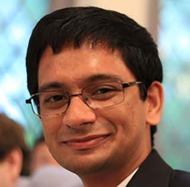 | Assistant Professor, Computer Science Department, UT Austin; Adjunct Assistant Professor, College of Information and Computer Sciences, UMass Amherst. I received my PhD in Robotics in 2014 from Carnegie Mellon University, and my B.Tech in Engineering Physics in 2008 from the Indian Institute of Technology, Bombay. My ultimate goal is to have self-sufficient autonomous mobile robots working in human environments, performing tasks accurately and robustly. In support of this goal, I am interested in research in perception, planning, and control applied to autonomous mobile robots.|
{: .people_table_hack}

---
### Research Engineers
---

#### Maxwell Svetlik

|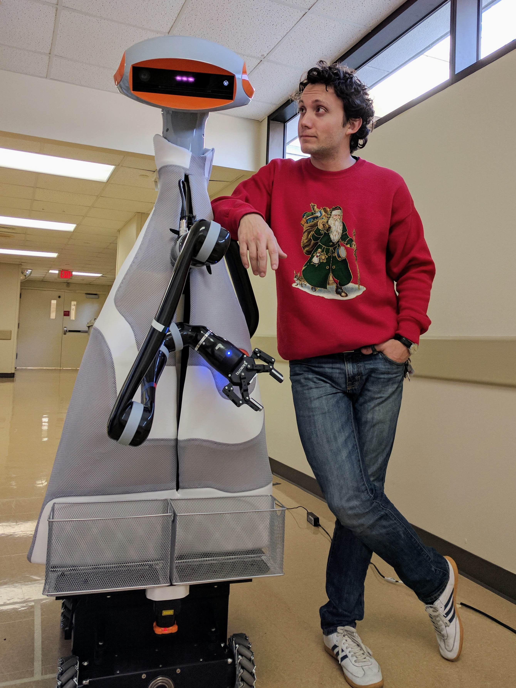 | I graduated from the University of Texas at Austin in with a Bachelors degree in 2016. Since then I've been in Robotics Engineering roles in industry with the umbrella goal of getting robots to perform in real world environments. I continue this goal at UT-AMRL and other UT Robotics labs by supporting fundamental research and making developed methods accessible to stakeholders. 
{: .people_table_hack}

#### [Logan Zartman](https://zartman.org)

| 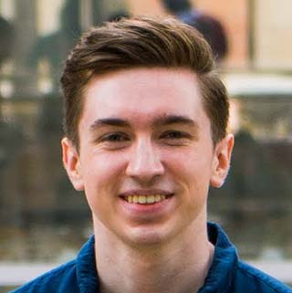 | I have a B.S. in Computer Science from UT Austin. I joined AMRL after participating in CS 378 Autonomous Driving. I'm working on developing a new web-based, multi-robot interface. My interests include web, graphics, and interactivity. |
{: .people_table_hack}

---
### Ph.D. Students
---

#### Jarrett Holtz

|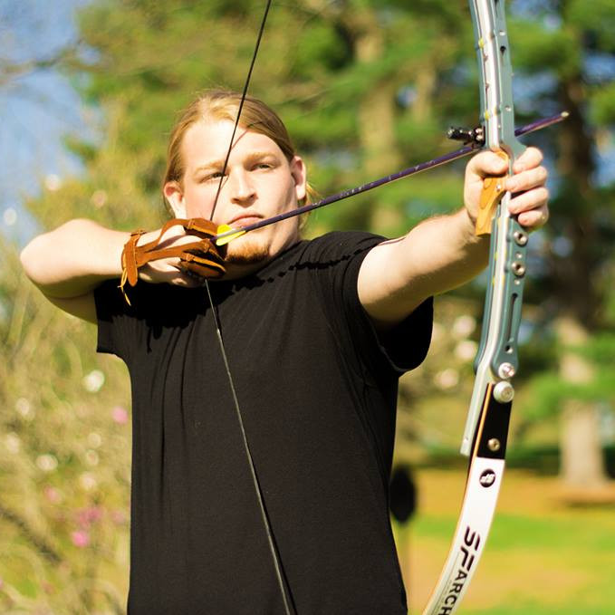 | I graduated from Vassar College with a degree in Computer Science before moving to the MS/PhD program at UMass Amherst and the Autonomous Mobile Robotics Laboratory. I'm working in robotics because I'm passionate about seeing robotics systems become commonplace as applied to a wide range of problems outside of just research environments. My research interests are in Robotics, Computer Vision, Artificial Intelligence and Software Engineering, with a focus on research that makes robots more adaptive to changes in themselves and the environment.|
{: .people_table_hack}

#### [Sadegh Rabiee](http://www.cs.utexas.edu/~srabiee/)

|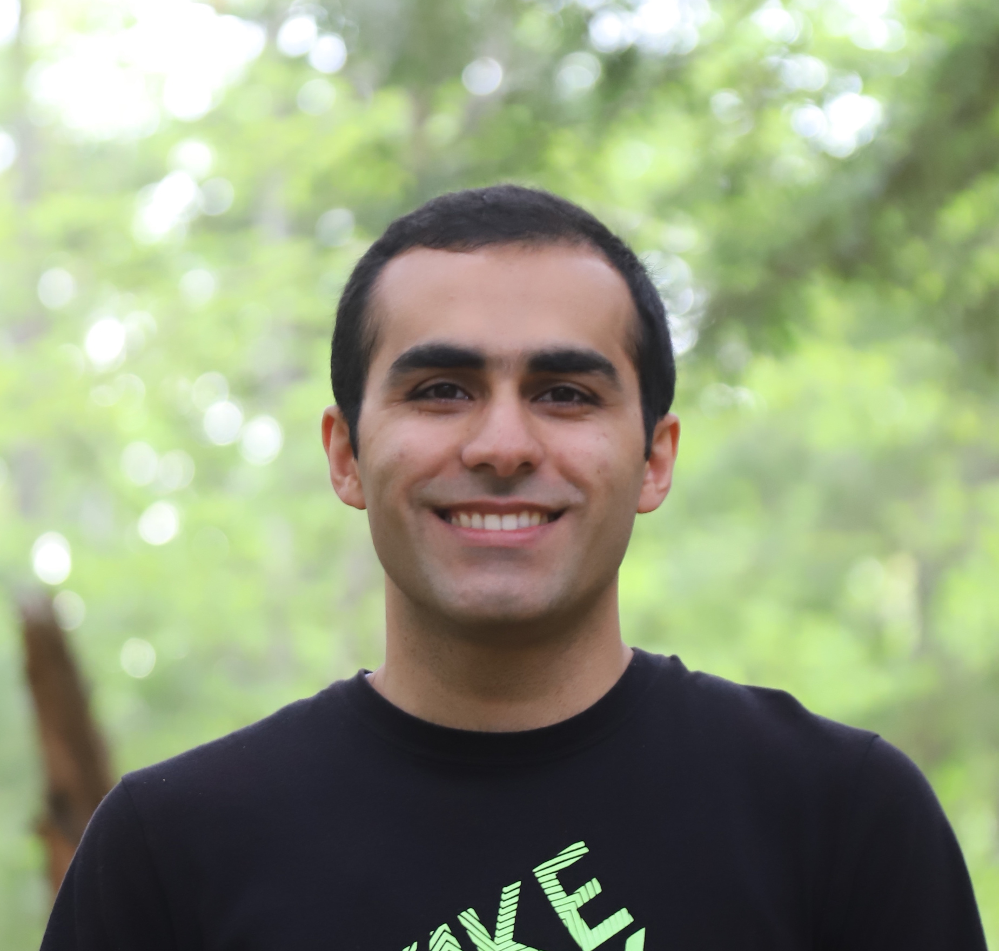 | I received a B.Sc. in Electrical Engineering at the University of Tehran in 2015 and a M.Sc. in Computer Science from the College of Information and Computer Sciences at UMass Amherst in 2018. I am now in the PhD program at the Department of Computer Science at UT Austin. I am interested in safe navigation for mobile robots via accurate motion models and perception algorithms that are competence-aware. |
{: .people_table_hack}

#### Emily Pruc

|  | I graduated from Brandeis University in 2015 with degrees in Physics and Chemistry. I then began working with the Autonomous Mobile Robotics Lab in the summer of 2018. I am currently enrolled in the College of Information and Computer Science MS/PhD program at the University of Massachusetts Amherst. My research interests include Robotics, Machine Learning, and Artificial Intelligence. |
{: .people_table_hack}

#### [Josh Hoffman](https://www.joshbhoffman.com/)

|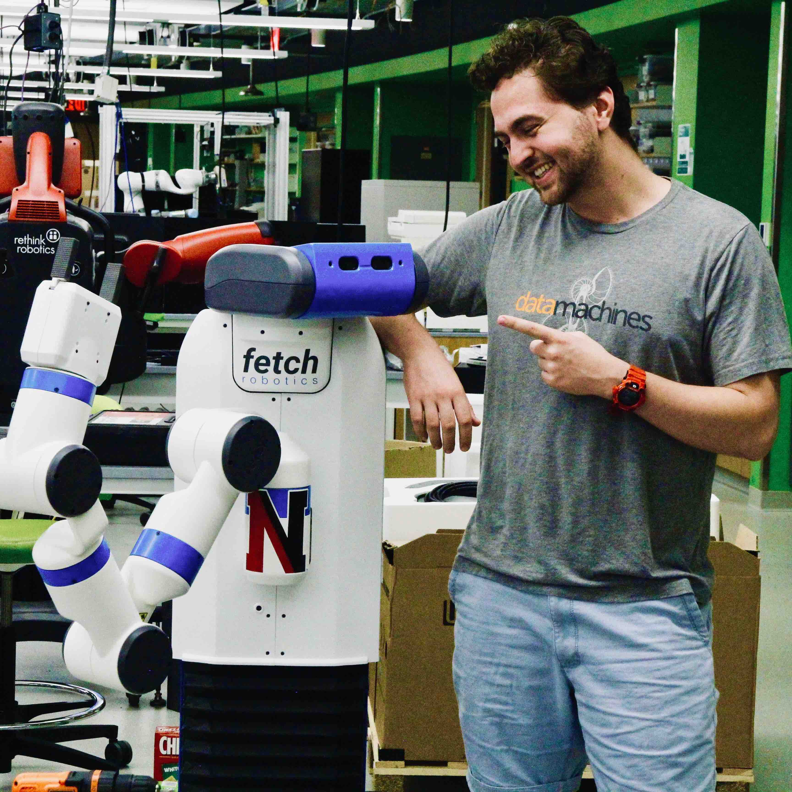  | I graduated from Northeastern University in 2020 with a B.S. in Computer Science, and I worked on deep MARL while there. I am now a first year PhD student at UT Austin where I am studying Computer Science. I joined AMRL during the summer of 2020, and my research interests include reinforcement learning, both single and multi-robot systems, deep learning, and artificial intelligence. |
{: .people_table_hack}

#### Kavan Sikand

|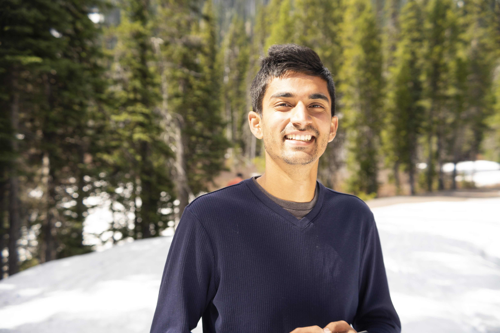  | I graduated from UC Berkeley in 2015 with a degree in Electrical Engineering and Computer Sciences. I began working with the Autonomous Mobile Robotics Lab when I started my PhD at UT Austin in fall of 2019. My research interests include Machine Learning, Computer Vision, and Robotics. |
{: .people_table_hack}

#### Amanda Adkins

|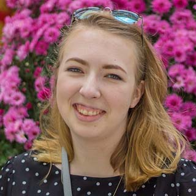  | I graduated from WPI in 2016 with a double major in Computer Science and Robotics Engineering. From 2016 to 2020, I worked at Amazon Robotics as a software development engineer. I joined AMRL and the Computer Science PhD program at UT Austin in fall 2020. My research interests include robotics, computer vision, and machine learning, with a focus on robotic perception for long-term autonomy. |
{: .people_table_hack}

#### Jack Borer

|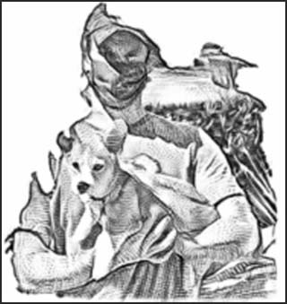  | I graduated from the University of Oklahoma in 2018 with a degree in Petroleum Engineering. After graduation I joined the Nuclear Robotics Group (NRG) at the University of Texas Austin and graduated with my Masters in Mechanical Engineering in December 2020. I am a member of both NRG and AMRL and am working towards a PhD with a focus on computer vision applications for long term autonomy. |
{: .people_table_hack}

---

### Undergraduate Students
---

#### Tongrui Li

| 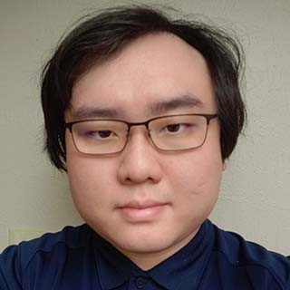 | I am an undergraduate studying computer science at UT Austin and joined AMRL at Summer of 2020. I am currently working on creating new controllers that handles multiple robots in the same environment. | 
{: .people_table_hack}

#### [Simon Andrews](https://simonandrews.org/)

|  | I am an undergraduate student majoring in computer science and mathematics at UMass Amherst. I'm currently working on applying program synthesis techniques to robotics. |
{: .people_table_hack}

---
### Previous Members
---

#### [Kyle Vedder](http://vedder.io)

| 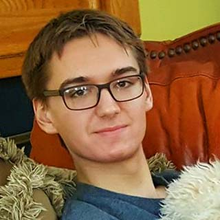 | PhD student at University of Pennsylvania |
{: .people_table_hack}

#### Alex Fischer

| 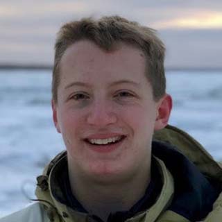 |  Software Engineer at Microsoft |
{: .people_table_hack}

#### Alyx Burns

|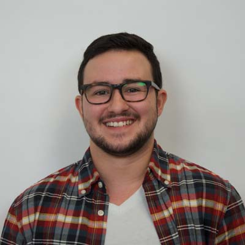 | PhD student at UMass Amherst|
{: .people_table_hack}

#### Edward Schneeweiss

| 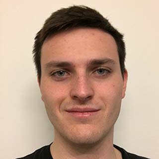 | MS student at UMass Amherst |
{: .people_table_hack}

#### Spencer Lane

| | PhD student at UMass Amherst|
{: .people_table_hack}

#### Samer Nashed

| | PhD student at UMass Amherst|
{: .people_table_hack}

#### George Larionov

|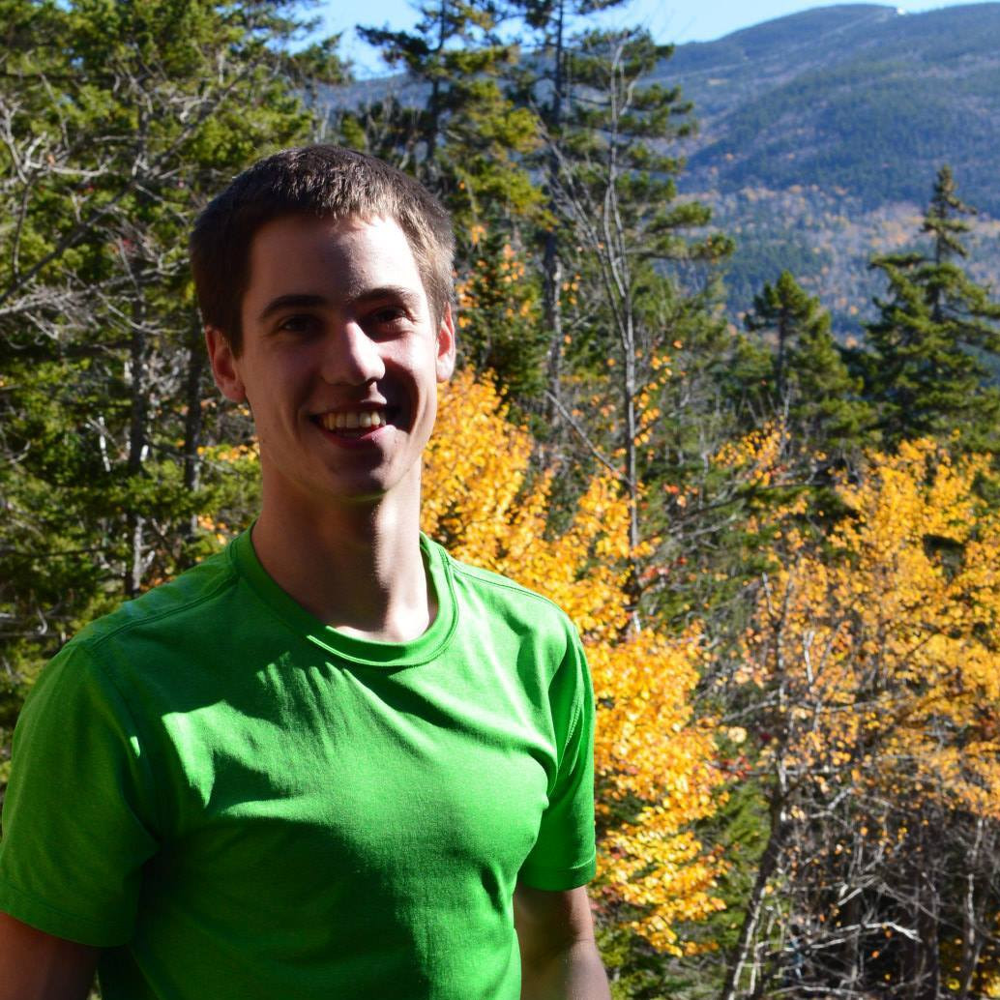 | MS student at Carnegie Mellon University |
{: .people_table_hack}

#### Sourish Ghosh

|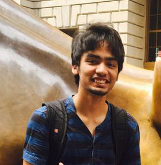| PhD student at Carnegie Mellon University |
{: .people_table_hack}

#### David Balaban

|  | PhD student at UT Austin |
{: .people_table_hack}

#### John Bachman

| 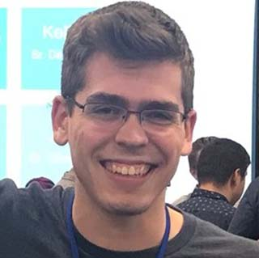 | Amazon Robotics |
{: .people_table_hack}