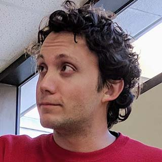
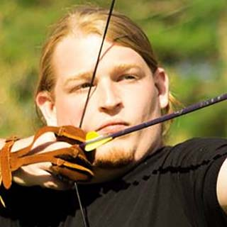
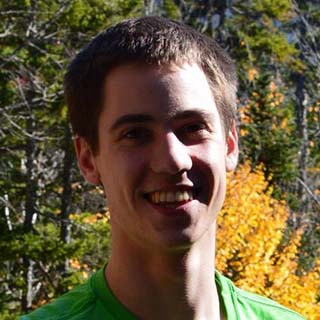
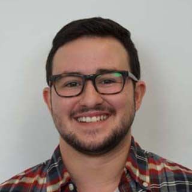
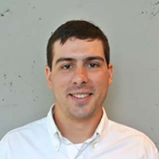

### Faculty

#### [Joydeep Biswas](https://www.joydeepb.com/)

| | Assistant Professor, Computer Science Department, UT Austin; Adjunct Assistant Professor, College of Information and Computer Sciences, UMass Amherst. I received my PhD in Robotics in 2014 from Carnegie Mellon University, and my B.Tech in Engineering Physics in 2008 from the Indian Institute of Technology, Bombay. My ultimate goal is to have self-sufficient autonomous mobile robots working in human environments, performing tasks accurately and robustly. In support of this goal, I am interested in research in perception, planning, and control applied to autonomous mobile robots.|
{: .people_table_hack}

---
### Research Engineers
---

#### Corrie Van Sice

| | I recently joined the CS staff from Dartmouth College Thayer School of Engineering where I was Senior Research Engineer and manager at the Green 3Dprinting Lab.  Over the last decade, I've developed research and facilities with academic, creative and private company labs, including MakerBot Industries' R&D.  I hold a Masters from NYU Interactive Telecommunications Program, 2011, and BFAs in Interdisciplinary Studio Arts.  I can help with electronics, software, and other common issues in mechatronics, and have special expertise in additive manufacturing and digital fabrication. |
{: .people_table_hack}

---
### Postdocs
---

#### [Nathan Tsoi](https://nathantsoi.com)

| | My doctoral work at Yale University introduced new simulation platforms, evaluation frameworks, and data-driven methods for aligning mobile robot behavior with human values. My research vision is to enable the widespread deployment of mobile robots that complete tasks reliably while interacting naturally with people. In pursuit of this vision, I am interested in developing robot learning systems that are sample efficient, robust to real-world uncertainty, and informed by technically grounded methods that predict and optimize for human-centric values.|
{: .people_table_hack}

---
### Ph.D. Students
---

#### [Amanda Adkins](https://mandi1267.github.io)

|  | I graduated from WPI in 2016 with a double major in Computer Science and Robotics Engineering. From 2016 to 2020, I worked at Amazon Robotics as a software development engineer. I joined AMRL and the Computer Science PhD program at UT Austin in fall 2020. My research interests include robotics, computer vision, and machine learning, with a focus on robotic perception for long-term autonomy. |
{: .people_table_hack}

#### [Arthur Zhang](https://www.arthurkzhang.com)

| | I graduated from the University of Michigan, Ann Arbor with a B.S.E in Computer Engineering in 2022. There, I worked at the Computational Autonomy and Robotics Laboratory conducting research on invariant state estimation and semantic mapping. I am now in the PhD program at the Department of Computer Science at UT Austin. I am interested broadly in advancing the robustness and scalability of perception algorithms in challenging dynamic conditions. |
{: .people_table_hack}

#### [Sadanand Modak](https://www.linkedin.com/in/sadanand-modak-85a9b91a9)

|   | I graduated from the Indian Institute of Technology Delhi in 2022 with B.Tech in Mechanical Engineering. I worked on projects in diverse areas during my undergrad, which include kinematics and synthesis of robotic manipulators, mutli-robot task allocation systems, computer vision, and development of soft robotic exosuit. I joined the PhD program in Computer Science at UT Austin thereafter in Fall 2022 and have been working as part of AMRL since then. My broad interests lie in long-term autonomy of mobile robots with a focus on advancing current planning/navigation and perception systems to reduce human intervention. |
{: .people_table_hack}

#### Zichao Hu

|   | I am a Ph.D. student at the University of Texas at Austin. Prior to joining AMRL, I graduated from the University of Virginia (UVa) in 2022 with B.S in Computer Engineering. My research interests are in social navigation and vision-language navigation. |
{: .people_table_hack}

#### Noah Patton

| | I am a PhD student in Computer Science at The University of Texas at Austin, working on neurosymbolic techniques for robotics. Broadly, I am interested in simultaneously imbuing robotic agents with high-level symbolic reasoning and low-level pattern recognition to improve the explainability of systems and their sample efficiency. Prior to entering the PhD program, I obtained my bachelor’s degree in Computer Engineering from the University of Toronto, where I worked on improving risk-sensitivity of action planning. |
{: .people_table_hack}

#### [Eric Hsiung](https://eric-hsiung.github.io/)

| | I am a PhD student at the University of Texas at Austin, co-advised by Joydeep Biswas and Swarat Chaudhuri. I currently focus on algorithms for enabling people to interactively teach intelligent agents using interactive learning models. I recieved my MS in Computer Science from Brown University, where I focused on reinforcement learning and methods for teaching intelligent machines, and received my BS in Engineering Physics from Cornell University. |
{: .people_table_hack}

#### Dongmyeong Lee

| | I am a PhD student in Computer Science at the University of Texas at Austin. I received my MS from the University of Michigan, Ann Arbor, conducting research on long-term autonomous navigation system at the Bipedal Robotics Laboratory. My research interests in advancing robot perception and environmental context learning for long-term autonomy. |
{: .people_table_hack}

#### [Taijing Chen](https://tiejean.github.io)

|  | I graduated from UW Madison with a B.S. in Computer Sciences in 2021. I joined AMRL and UT Austin as a Computer Science Master student at 2021 fall. I am currently working on long-term robot perception and state estimation. | 
{: .people_table_hack}

---
### Masters Students
---

---
### Undergraduate Students
---

### [Rahul Menon](https://rmeno12.github.io/about/)

|  | I am an undergraduate student at UT Austin pursuing a B.S. in Computer Science and joined AMRL in the winter of 2022. I am currently working on long-term robot perception and state estimation. |
{: .people_table_hack}

#### Luisa Mao

|   | I am an undergraduate CS major at UT Austin, and I joined AMRL in the summer of 2022. I’m currently working on navigation, path planning, and motion planning tasks. Broadly, I’m interested in autonomy and ML in motion control.|
{: .people_table_hack}

---
### Previous Members
---

#### Jiayi Wei

|   ||
{: .people_table_hack}

#### Josh Hoffman

|  ||
{: .people_table_hack}

#### Maxwell Svetlik

| ||
{: .people_table_hack}

#### [Rohan Chandra](http://rohanchandra30.github.io/)

| ||
{: .people_table_hack}

#### [Kia Rahmani](https://kiarahmani.github.io/)

| ||
{: .people_table_hack}

#### [Logan Zartman](https://zartman.org)
    
|  ||
{: .people_table_hack}

#### Tongrui Li

|  ||
{: .people_table_hack}

#### Jack Borer

|  ||
{: .people_table_hack}

#### [Simon Andrews](https://simonandrews.org/)

|  ||
{: .people_table_hack}

#### Jarrett Holtz

| ||
{: .people_table_hack}

#### [Sadegh Rabiee](http://www.cs.utexas.edu/~srabiee/)

| | |
{: .people_table_hack}

#### Emily Pruc

|  | |
{: .people_table_hack}

#### Kavan Sikand

|  | |
{: .people_table_hack}

#### [John Bachman](https://thecynosure.github.io/)

|  | Software Engineer at Amazon Robotics |
{: .people_table_hack}

#### Alex Fischer

|  |  Software Engineer at Microsoft |
{: .people_table_hack}

#### Edward Schneeweiss

|  | MS student at UMass Amherst |
{: .people_table_hack}

#### George Larionov

| | MS student at Carnegie Mellon University |
{: .people_table_hack}

#### [Kyle Vedder](http://vedder.io)

|  | PhD student at University of Pennsylvania |
{: .people_table_hack}

#### Alyx Burns

| | PhD student at UMass Amherst|
{: .people_table_hack}

#### Spencer Lane

| | PhD student at UMass Amherst|
{: .people_table_hack}

#### Samer Nashed

| | PhD student at UMass Amherst|
{: .people_table_hack}

#### Sourish Ghosh

|| PhD student at Carnegie Mellon University |
{: .people_table_hack}

#### David Balaban

|  | PhD student at UT Austin |
{: .people_table_hack}
