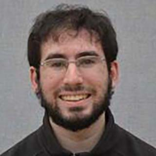

### Faculty

#### [Joydeep Biswas](https://www.joydeepb.com/)

|  | Assistant Professor, College of Information and Computer Sciences, UMass Amherst. Prior to joining UMass in 2015, I was a postdoctoral fellow in the Computer Science Department at Carnegie Mellon University. I received my PhD in Robotics in 2014 from Carnegie Mellon University, and my B.Tech in Engineering Physics in 2008 from the Indian Institute of Technology, Bombay. My ultimate goal is to have self-sufficient autonomous mobile robots working in human environments, performing tasks accurately and robustly. In support of this goal, I am interested in research in perception, planning, and control applied to autonomous mobile robots.|
{: .people_table_hack}

---

### Ph.D. Students

#### Jarrett Holtz

| | I graduated from Vassar College with a degree in Computer Science before moving to the MS/PhD program at UMass Amherst and the Autonomous Mobile Robotics Laboratory. I'm working in robotics because I'm passionate about seeing robotics systems become commonplace as applied to a wide range of problems outside of just research environments. My research interests are in Robotics, Computer Vision, Artificial Intelligence and Software Engineering, with a focus on research that makes robots more adaptive to changes in themselves and the environment.|
{: .people_table_hack}

#### Spencer Lane

| | I am a Ph.D. student here at UMass Amherst. I received a B.S. in Modeling and Simulation Engineering from Old Dominion University in 2013 and an S.M. in Aeronautics and Astronautics in 2016. I am interested in Multi-Agent Planning, Human Robot Interaction, and Machine Learning.|
{: .people_table_hack}

#### Samer Nashed

| | Originally from Maine, I graduated in 2015 from Swarthmore College with degrees Physics and Computer Science. I am now in the MS/PhD program here at UMass and am working on a number of projects, with topics including mapping, navigation, calibration, and electromechanical design. |
{: .people_table_hack}

#### [Sadegh Rabiee](http://people.cs.umass.edu/srabiee)

|  | I received my B.Sc. in electrical engineering at the University of Tehran in 2015. I am now on the MS/PhD track in the College of Information and Computer Sciences at UMass. I am interested in safe navigation for mobile robots via accurate motion models and perception algorithms that are competency-aware. |
{: .people_table_hack}

#### Alyx Burns

| | I graduated in 2017 from Mount Holyoke College with a major in Computer Science and a minor in Theater. I am now a MS/PhD student interested in multi-agent systems, computer vision, and social robotics.|
{: .people_table_hack}

---
### Masters Students

#### David Balaban

|  | I graduated from UMass in 2016 with two Bachelor of Science degrees, one in Physics and one in Computer Science and a minor in Mathematics. I am now a graduate student at UMass pursuing a Masters degree in Computer Science. My research interests are in Robotics and Optimal Control, Robot Autonomy, Artificial Intelligence and Machine Learning. My long-term career goal is to work to make space exploration more accessible through autonomous robotic technologies. |
{: .people_table_hack}

---

### Research Assistants

#### [Kyle Vedder](http://vedder.io)

|  | I graduated with a B.S. in Computer Science from UMass Amherst in 2018. I am now a Research Assistant in AMRL. My research interests include single and multiagent planning/scheduling, safe control in dynamic environments, manipulation, and building tools to make robot controllers robust. |
{: .people_table_hack}

---

### Undergraduate Students

#### Alex Fischer

|  |  I am an undergraduate studying computer science and math at UMass. My interests lie in the intersection of mathematics and computer science, including control theory, computer vision, and artificial intelligence. |
{: .people_table_hack}

#### Edward Schneeweiss

|  | I am an undergraduate at UMass, and I joined AMRL in 2015 having had some prior experience from running a VEX robotics club for 5 years. LightSpeed robotics won several state championships and participated in two World Championships. My interests are in all software and hardware aspects of robots with a particular interest in swarm robotics and the associated autonomous control challenges. |
{: .people_table_hack}

#### John Bachman

|  | I am an undergraduate majoring in Computer Science at UMass. I have been studying in AMRL since the fall of 2019. My area of interest is robotic perception and computer vision. Particularly, I work on the SLAM problem and integrating new forms of sensory data as additional constraints. |
{: .people_table_hack}

---

### Alumni 
#### George Larianov

| | I am an undergrad Computer Science student here at UMass, and I am interested in speech recognition using neural networks, as well as effective human-robot interaction.|
{: .people_table_hack}

#### Sourish Ghosh

|| I am a junior undergraduate at IIT Kharagpur, majoring in Mathematics and Computing. My research interests lie in the intersection of computer vision and robotics, and I was a visiting student at AMRL during summer 2016.|
{: .people_table_hack}
