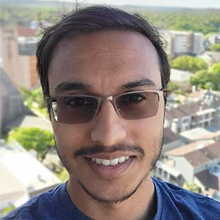
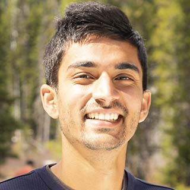

### Faculty

#### [Joydeep Biswas](https://www.joydeepb.com/)

| | Assistant Professor, Computer Science Department, UT Austin; Adjunct Assistant Professor, College of Information and Computer Sciences, UMass Amherst. I received my PhD in Robotics in 2014 from Carnegie Mellon University, and my B.Tech in Engineering Physics in 2008 from the Indian Institute of Technology, Bombay. My ultimate goal is to have self-sufficient autonomous mobile robots working in human environments, performing tasks accurately and robustly. In support of this goal, I am interested in research in perception, planning, and control applied to autonomous mobile robots.|
{: .people_table_hack}

---
### Research Engineers
---

#### Corrie Van Sice

|  | I recently joined the CS staff from Dartmouth College Thayer School of Engineering where I was Senior Research Engineer and manager at the Green 3Dprinting Lab.  Over the last decade, I've developed research and facilities with academic, creative and private company labs, including MakerBot Industries' R&D.  I hold a Masters from NYU Interactive Telecommunications Program, 2011, and BFAs in Interdisciplinary Studio Arts.  I can help with electronics, software, and other common issues in mechatronics, and have special expertise in additive manufacturing and digital fabrication. |
{: .people_table_hack}

---
### Postdocs
---

#### [Rohan Chandra](http://rohanchandra30.github.io/)

| | Rohan obtained his B.Tech from the Delhi Technological University, New Delhi in 2016 and completed his MS and PhD in 2018 and 2022 from the University of Maryland advised by Dr. Dinesh Manocha. His doctoral thesis focused on autonomous driving in dense, heterogeneous, and unstructured traffic environments, and published his work in top computer vision and robotics conferences (CVPR, ICRA, IROS, etc.). Rohan is a Microsoft Future Leader in Robotics and AI, KAUST Rising Star in AI 2023, UMD’21 Future Faculty Fellow, RSS’22 Pioneer, and he is a recipient of the UMD’20 summer research fellowship. He is currently serving as an Associate Editor for RA-L. Rohan research interests span multi-agent planning and navigation, autonomous driving, and social robot navigation.|
{: .people_table_hack}

#### [Kia Rahmani](https://kiarahmani.github.io/)

| | I obtained my PhD in 2022 from Purdue University, where I was supervised by S. Jagannathan and B. Delaware. My main research interests are symbolic analysis and synthesis of neural-powered programs, specifically designed for learning advanced long-term autonomy in mobile robotic fleets. Outsude academia, I am very passionate about martial arts, and specifically, I spend time learning and practicing the Brazilian Jiu Jitsu style of self-defense.  |
{: .people_table_hack}

---
### Ph.D. Students
---

#### [Amanda Adkins](https://mandi1267.github.io)

|  | I graduated from WPI in 2016 with a double major in Computer Science and Robotics Engineering. From 2016 to 2020, I worked at Amazon Robotics as a software development engineer. I joined AMRL and the Computer Science PhD program at UT Austin in fall 2020. My research interests include robotics, computer vision, and machine learning, with a focus on robotic perception for long-term autonomy. |
{: .people_table_hack}

#### [Jiayi Wei](https://mrvplusone.github.io/)

|   | I graduated with a B.Sc. in physics from the University of Science and Technology of China in 2017 and joined [The UTOPIA group](http://utopia.cs.utexas.edu/) at UT the same year. My past research has been mostly focusing on fusing machine learning with programming language techniques, and I started to work with Joydeep in 2020. I am currently co-advised by him and Isil Dillig, working on probabilistic program synthesis for robot learning. |
{: .people_table_hack}

#### [Josh Hoffman](https://joshbhoffman.com/)

|  | I graduated from Northeastern University in 2020 with a B.S. in Computer Science. I am now a PhD student at UT Austin studying Computer Science. My past research has focussed on deep multi-agent reinforcement learning, and my current research interests include deep reinforcement learning, artificial intelligence, and program synthesis for autonomy. Additionally, I am a lab member of [Trishul @ UT Austin](https://trishul.us) |
{: .people_table_hack}

#### [Arthur Zhang](https://www.arthurkzhang.com)

| | I graduated from the University of Michigan, Ann Arbor with a B.S.E in Computer Engineering in 2022. There, I worked at the Computational Autonomy and Robotics Laboratory conducting research on invariant state estimation and semantic mapping. I am now in the PhD program at the Department of Computer Science at UT Austin. I am interested broadly in advancing the robustness and scalability of perception algorithms in challenging dynamic conditions. |
{: .people_table_hack}

#### [Sadanand Modak](https://www.linkedin.com/in/sadanand-modak-85a9b91a9)

|   | I graduated from the Indian Institute of Technology Delhi in 2022 with B.Tech in Mechanical Engineering. I worked on projects in diverse areas during my undergrad, which include kinematics and synthesis of robotic manipulators, mutli-robot task allocation systems, computer vision, and development of soft robotic exosuit. I joined the PhD program in Computer Science at UT Austin thereafter in Fall 2022 and have been working as part of AMRL since then. My broad interests lie in long-term autonomy of mobile robots with a focus on advancing current planning/navigation and perception systems to reduce human intervention. |
{: .people_table_hack}

#### Zichao Hu

|   | | I am a Ph.D. student at the University of Texas at Austin. Prior to joining AMRL, I graduated from the University of Virginia (UVa) in 2022 with B.S in Computer Engineering. My research interests are in social navigation and vision-language navigation. 
{: .people_table_hack}

---
### Masters Students
---

#### [Taijing Chen](https://tiejean.github.io/about.html)

|  | I graduated from UW Madison with a B.S. in Computer Sciences in 2021. I joined AMRL and UT Austin as a Computer Science Master student at 2021 fall. I am currently working on long-term robot perception and state estimation. | 
{: .people_table_hack}

---

### Undergraduate Students
---

### [Rahul Menon](https://rmeno12.github.io/about/)

|  | I am an undergraduate student at UT Austin pursuing a B.S. in Computer Science and joined AMRL in the winter of 2022. I am currently working on long-term robot perception and state estimation. |
{: .people_table_hack}

#### Luisa Mao

|   | I am an undergraduate CS major at UT Austin, and I joined AMRL in the summer of 2022. I’m currently working on navigation, path planning, and motion planning tasks. Broadly, I’m interested in autonomy and ML in motion control.|
{: .people_table_hack}

---
### Previous Members
---

#### Maxwell Svetlik

| ||
{: .people_table_hack}

#### [Logan Zartman](https://zartman.org)
    
|  ||
{: .people_table_hack}

#### Tongrui Li

|  ||
{: .people_table_hack}

#### Jack Borer

|  ||
{: .people_table_hack}

#### [Simon Andrews](https://simonandrews.org/)

|  ||
{: .people_table_hack}

#### Jarrett Holtz

| ||
{: .people_table_hack}

#### [Sadegh Rabiee](http://www.cs.utexas.edu/~srabiee/)

| | |
{: .people_table_hack}

#### Emily Pruc

|  | |
{: .people_table_hack}

#### Kavan Sikand

|  | |
{: .people_table_hack}

#### [John Bachman](https://thecynosure.github.io/)

|  | Software Engineer at Amazon Robotics |
{: .people_table_hack}

#### Alex Fischer

|  |  Software Engineer at Microsoft |
{: .people_table_hack}

#### Edward Schneeweiss

|  | MS student at UMass Amherst |
{: .people_table_hack}

#### George Larionov

| | MS student at Carnegie Mellon University |
{: .people_table_hack}

#### [Kyle Vedder](http://vedder.io)

|  | PhD student at University of Pennsylvania |
{: .people_table_hack}

#### Alyx Burns

| | PhD student at UMass Amherst|
{: .people_table_hack}

#### Spencer Lane

| | PhD student at UMass Amherst|
{: .people_table_hack}

#### Samer Nashed

| | PhD student at UMass Amherst|
{: .people_table_hack}

#### Sourish Ghosh

|| PhD student at Carnegie Mellon University |
{: .people_table_hack}

#### David Balaban

|  | PhD student at UT Austin |
{: .people_table_hack}
