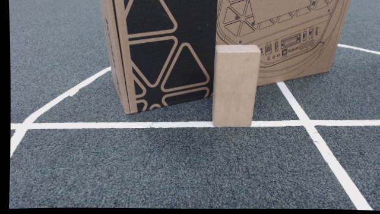
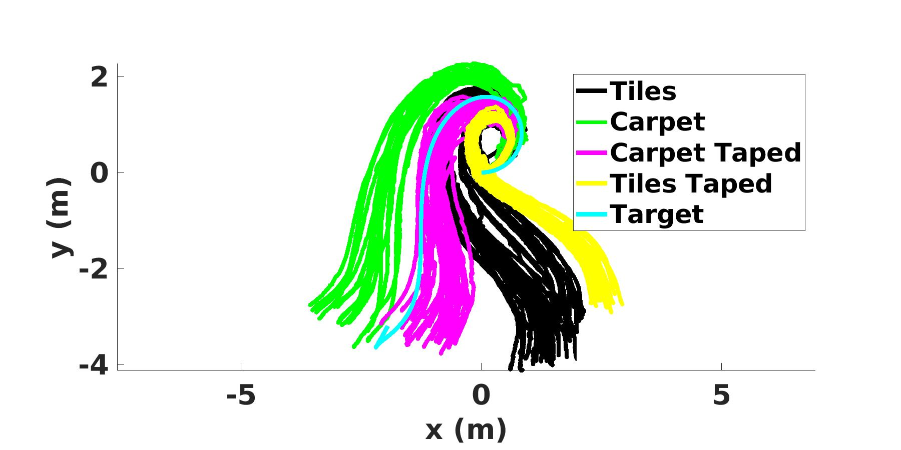

### Research

#### Themes

Our research spans three broad themes:

1. **Perception for long-term autonomy**, including long-term vector mapping, human-in-the-loop SLAM, and robust vision-only navigation
1. **Failure recovery for deployed robots**, including automated multi-sensor recalibration
1. **Multi-agent navigation and motion planning**,  including high-speed multiagent navigation in adverserial domains, and time-optimal control.

#### Code

All of the public code associated with our research can be found at [https://github.com/umass-amrl/]( https://github.com/umass-amrl/).

### Projects

#### Multi-Human Single Robot Simultaneous Interaction

|    |In order for robots to engage fully with humans, they must be able to communicate with multiple humans simultaneously. This project aims to develop an omni-directional interface for multiple humans to ask a robot questions and a method for finding the most useful way for the robot to answer all of those questions simultaneously. |
{: .research_table_hack}

---

#### Instrospective Vision for Obstacle Avoidance (IVOA)

|  | Vision, as an inexpensive yet information rich sensor, is commonly used for perception on autonomous mobile robots. However, vision systems are prone to errors from various sources such as image saturation, blur, and texture-less scenes. In this project, we develop an approach for self-supervised learning of a model that can predict failures of stereo vision-based obstacle avoidance systems. The learned model predicts the probability of different types of failure (false positive and false negative) and pinpoints the location of the error on the input image. ([More Information](papers/iVOA.pdf)). |
{: .research_table_hack}

---

#### Friction-Based Kinematic Model for Skid-Steer Wheeled Mobile Robots

|   | Skid-steer drive systems are widely used in mobile robot platforms. Such systems are subject to significant slippage and skidding during normal operation due to their nature. The ability to predict and compensate for such slippages in the forward kinematics of these types of robots is of great importance and provides the means for accurate control and safe navigation. In this work, we propose a new kinematic model capable of slip prediction for skid-steer wheeled mobile robots (SSWMRs) leveraging the wheel-ground contact model. ([More Information](papers/icra2019_skid_steer_kinematics.pdf)). |
{: .research_table_hack}

---

#### [Expanding A* (X*)](papers/expanding_astar_aamas_extended_abstract.pdf)

|  | Expanding A* is an anytime multiagent path planner which leverages two observations: 1) conflicts between multi-agent plans often have geometrically local resolutions within a small repair window, even if such local resolutions are not globally optimal; and 2) the partial search tree for such local resolutions can then be iteratively improved over successively larger windows to eventually compute the global optimal plan. X* operates by replanning locally, and then, as shown in the image, growing the scope of the local repair as time permits. ([More Information](papers/expanding_astar_aamas_extended_abstract.pdf)). |
{: .research_table_hack}

---

#### Human in the loop SLAM (HitL SLAM)

|   | Autonomous mapping of environments is challenging, especially when areas may be very large and subject to frequent minor changes. Currently, fully autonomous state-of-the-art mapping methods still struggle when faced with difficult environments and/or novice users. Using a variety of analytical and non-linear optimization tools, this project is aimed at boosting the accuracy and success rates of mapping algorithms, with minimal effort from a human. ([More Information](https://www.joydeepb.com/Publications/aaai2018_hitl-slam.pdf)). |
{: .research_table_hack}

---

#### Computationally Efficient, Safe Navigation Using Stereo Vision

|   | This research focuses on integrated planning and perception for local obstacle avoidance using stereo RGB cameras for autonomous mobile robots. By integrating planning and perception, we expect to significantly reduce the computational requirements for safe navigation, while still remaining robust to arbitrary obstacles in the robot’s path. The test platform for this research is a Clearpath Jackal UGV. ([GitHub repository](https://github.com/umass-amrl/jpp)). |
{: .research_table_hack}

---

#### Delta Calibration

|  | Delta-Calibration is an automatic method for extrinsic calibration of sensors based on ego-motion. Delta-Calibration involves a closed form solution to the extrinsic calibration given necessary ego-motions performed by rigid bodies of connected sensors. An optimization based solution to Delta-Calibration can calculate even with limited axes of ego-motion, and limited information in the environment. ([GitHub repository](https://github.com/umass-amrl/DeltaCalibration)). |
{: .research_table_hack}

#### [Automatic State Machine Debugging](srtr.html)

|  An example failure case from the Robocup Small Sized League domain. Blue lines represent the robot path, and orange lines the ball path. The left image shows a failure case in which the robot fails to transition into the kick state, while the right image shows the desired behavior. | State machines are a common tool for building controllers for various robotic tasks. The effectiveness of a state machine is often dependent on the parameters used for transition and emissions, and in many cases these parameters are a source of human introduced error. The goal of this research is to create a system which does the following: 1) Identifies state machines and extract their parameters from source code using static analysis. 2) Detects faults in these state machines via anomaly detection or domain-specific error functions. 3) Identifies a modification to the transition and emission parameters for the state machine that corrects the error. ([More Information](srtr.html)). |
{: .research_table_hack}

#### Time-Optimal Control For Omnidirectional Robots

|  |  Omnidirectional robots are used in a number of domains, including service mobile robots, warehouse robots, and robot soccer. Despite their popularity, true time-optimal control of omnidirectional robots with acceleration and velocity limits remains an unsolved problem. This research aims to develop algorithms with bounded run-time to solve the time-optimal control for omnidirectional robots, while producing numerically stable solutions that may be used in iterative closed-loop control under sensing and actuation uncertainty. ([More Information](https://www.joydeepb.com/Publications/iros2018_tsocs.pdf)). |
{: .research_table_hack}

---

#### Graph Planning in Dynamic Adversarial Multi-Agent Domains

|  | One of the common approaches to motion planning in continuous space is to discretize the search space using a graph or tree and search over that reduced space. There are many approaches and decompositions that aid in constructing such graphs. In order to supplement these existing graph planning algorithms in dynamic domains with moving obstacles, we introduce strategies for supplementing probabilistic roadmaps with dynamic obstacle-dependent sub-graphs to aid in the search of high-quality paths while requiring only a coarse offline graph. ([More Information](//www.joydeepb.com/Publications/planrob2017_scaffold.pdf).)      |
{: .research_table_hack}

---

#### Multiple Model Learning for Ground Robots

|   | Having an accurate motion model for a robot is equivalent to being able to accurately predict the behavior of the robot, which in turn provides the means for accurate control. Learning a motion model could be achieved through various system identification methods, which essentially train a function approximator for this purpose. However, the dynamics of a robot could not always be expressed within one single model, or in order for a single model to be complex and expressive enough, one should train it with extensive amount of training data. We approach this problem by breaking it into smaller pieces and learn multiple simple models rather than one single complex model. The robot could then switch between these models and choose the appropriate one at each time. We apply this method to the case of a ground robot and show how multiple models could be learned for different types of terrain to improve the overall motion model accuracy for the robot.|
{: .research_table_hack}
