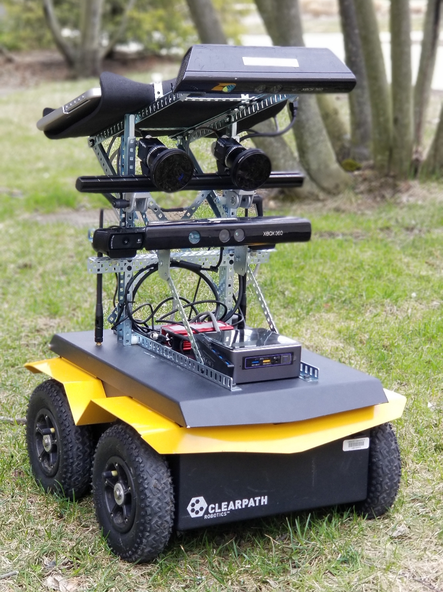
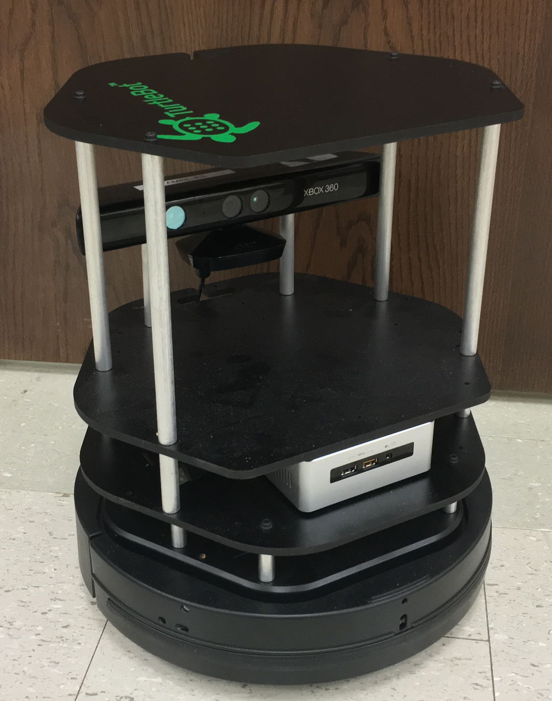

### Robots

#### UMass MinuteBots - Small Size Soccer Robots

|  | RoboCup Small Size League. The robots are 180mm in diameter and under 15cm tall, and can travel up to 5 m/s and kick, chip-kick, and dribble a golf ball. The robots are centrally controlled via radio, and perception is using an overhead vision system, [SSL-Vision](https://github.com/RoboCup-SSL/ssl-vision). We competed in our first international tournament in Nagoya, Japan in 2017, where we took first place in the lower bracket, and competed in our second tournament in Montreal, Canada in 2018, where we tied for fifth place in Division A. The RoboCup team is an important platform for ongoing research in the lab on topics such as automatic debugging, time-optimal control, and graph planning in adversarial domains. |
{: .robots_table_hack}

---

#### Clearpath Jackal

| | The Jackal is used for research on campus-scale long-term autonomy at UMass. It is equipped with a stereo vision system and inertial sensors, and an Intel NUC PC for onboard computation. |
{: .robots_table_hack}

---

#### Turtlebot 2

| | We use our turtlebots for a variety of experiments including calibration, mapping, navigation, and safety algorithms. We also use them as experimental platforms for projects in robotics courses, and as teaching and demonstration tools for lab visits. |
{: .robots_table_hack}

