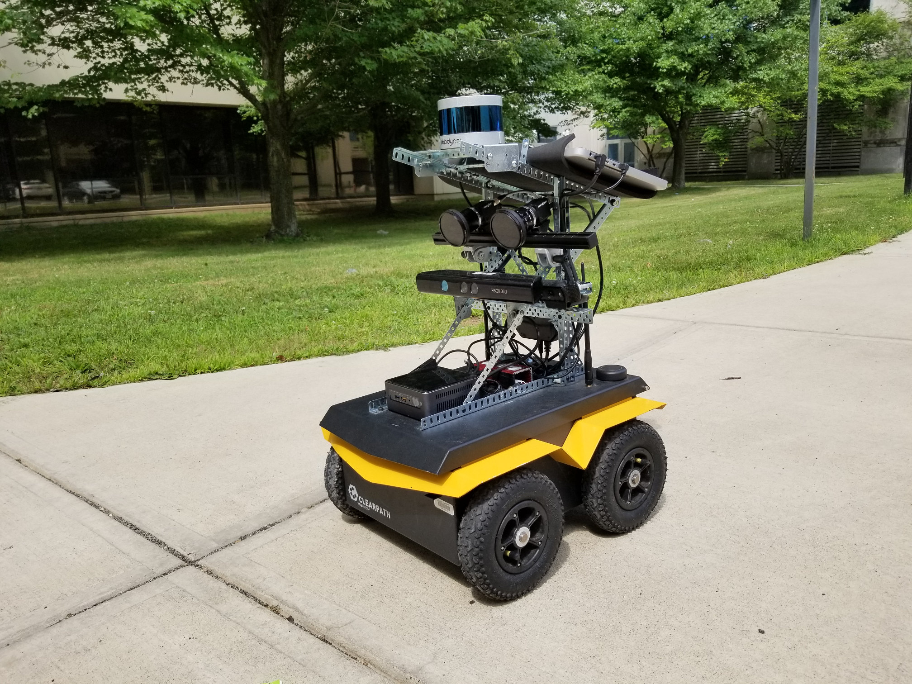
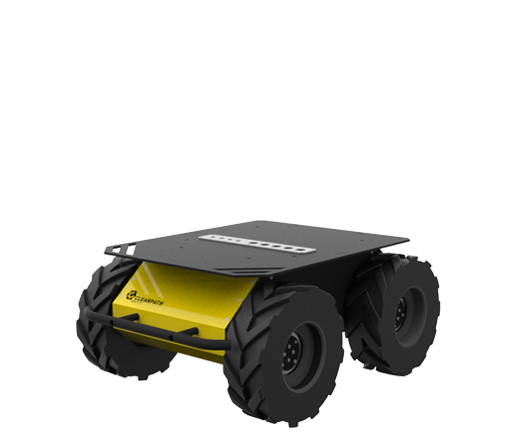
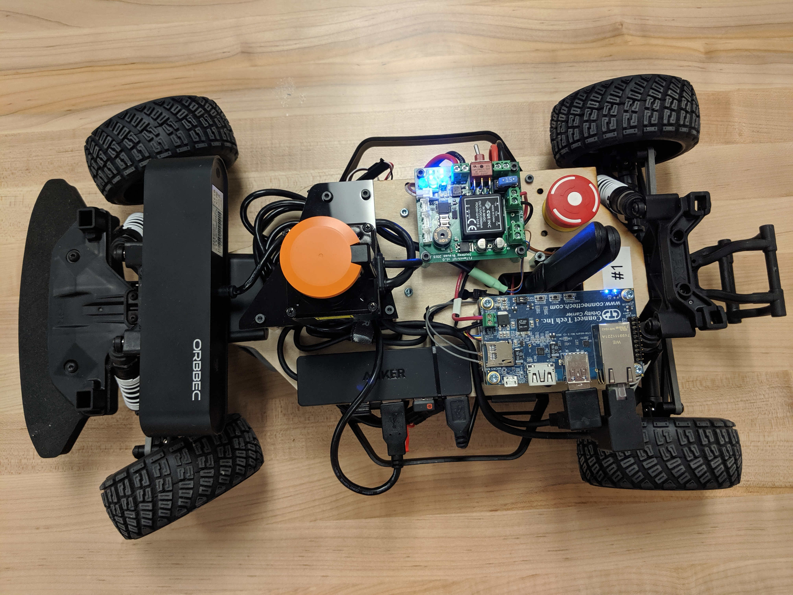
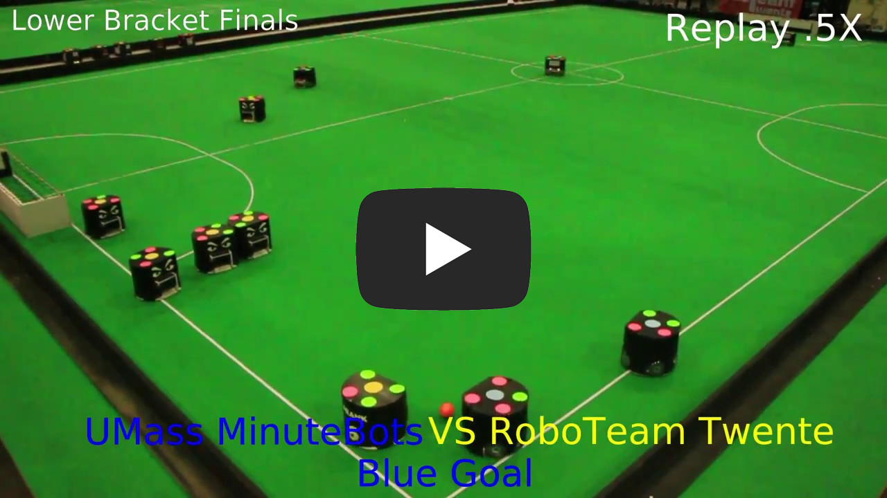

### Robots

---

#### Clearpath Jackal - UT/UMass

| | The Jackal is used for research on campus-scale long-term autonomy at both UT and UMass. It is equipped with a stereo vision system and inertial sensors, as well as LiDAR and high-precision GPS tracking. |
{: .robots_table_hack}

---

#### Clearpath Husky - UT

| | The Husky is used for research on campus-scale long-term autonomy at UT. It is equipped with a stereo vision system and inertial sensors, as well as LiDAR and high-precision GPS tracking. |
{: .robots_table_hack}

---

#### [UT AutoMATA](automata.html)

| | The UT AutoMATA are used for both instruction and for planning & perception research in indoor environments. More information on these autonomous f1tenth scale cars can be found here.|
{: .robots_table_hack}

---

#### UT Cobot

| | The Cobot is used for research on localization, perception, and human interaction in indoor environments at UT. It is equipped with a depth sensor, a monocular camera, a 2d LiDAR scanner, an onboard laptop with a graphical user interface for human interaction. |
{: .robots_table_hack}

---

#### [UMass MinuteBots - Small Size Soccer Robots](minutebots.html)

|  | RoboCup Small Size League. The robots are 180mm in diameter and under 15cm tall, and can travel up to 5 m/s and kick, chip-kick, and dribble a golf ball. The robots are centrally controlled via radio, and perception is using an overhead vision system, [SSL-Vision](https://github.com/RoboCup-SSL/ssl-vision). We competed in our first international tournament in Nagoya, Japan in 2017, where we took first place in the lower bracket, and competed in our second tournament in Montreal, Canada in 2018, where we tied for fifth place in Division A. The RoboCup team is an important platform for ongoing research in the lab on topics such as automatic debugging, time-optimal control, and graph planning in adversarial domains. |
{: .robots_table_hack}
